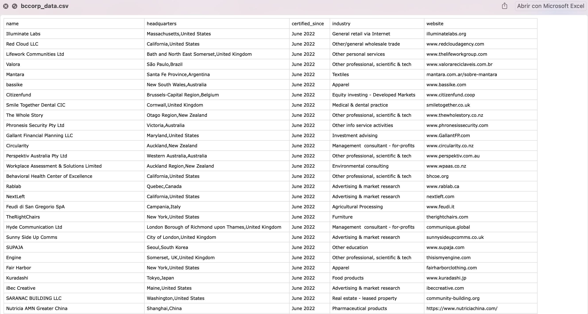

# bccorp_scraper
A web scraper to obtain the information from BcCorporation website. 
This scraper is based in the next [UpWork project requirement](https://www.upwork.com/nx/jobs/search/details/~014d974183450d05c2?q=web%20scraping&sort=recency&page=3&pageTitle=Job%20Detail&_navType=slider&_modalInfo=%5B%7B%22navType%22%3A%22slider%22,%22title%22%3A%22Job%20Detail%22,%22modalId%22%3A%221656294582458%22%7D%5D).

## Technologies used:
* Python
* Requests module
* Logging module
* Zyte proxy manager
* pandas

